<div align="center">

<!-- ===================== BANNER ===================== -->

<picture>
  <source media="(prefers-color-scheme: dark)" srcset="https://capsule-render.vercel.app/api?type=waving&color=0:EF93C4,50:F8BBD0,100:FF69B4&height=220&section=header&text=Kartik%20Goyal&fontSize=60&fontColor=ffffff&animation=fadeIn&fontAlignY=35">
  <source media="(prefers-color-scheme: light)" srcset="https://capsule-render.vercel.app/api?type=waving&color=0:FF69B4,50:F8BBD0,100:EF93C4&height=220&section=header&text=Kartik%20Goyal&fontSize=60&fontColor=ffffff&animation=fadeIn&fontAlignY=35">
  
</picture>

<br>

# Hey there, I'm Kartik Goyal 👋

<a href="https://git.io/typing-svg">
  
</a>

<br>

<!-- ===================== BADGES ===================== -->

<a href="https://github.com/kartikgoyal368">
  
</a>
<a href="https://github.com/kartikgoyal368?tab=repositories">
  
</a>
<a href="https://github.com/kartikgoyal368">
  
</a>

</div>

<br>

---

## 👨‍💻 About Me

<table>
<tr>
<td width="65%" valign="top">

### Hey! I'm Kartik 👋

I'm a **Computer Science undergraduate and software developer** who enjoys turning ideas into real, working products.

- 💻 Full Stack & Backend Development
- ⚙️ Building scalable and production-ready applications
- 🚀 Interested in DevOps, Cloud & Automation
- 🧠 Regularly solving Data Structures & Algorithms problems
- 🏆 Hackathon enthusiast and problem solver
- 🔧 Exploring new technologies by building projects
- 🌱 Currently improving my system design and backend engineering skills
- 🎯 Goal: Build software that solves meaningful real-world problems

<br>

> **"Build. Break. Learn. Repeat."**

</td>

<td width="35%" align="center" valign="middle">


</td>
</tr>
</table>

<br>

---

## 🛠️ Tech Stack

<div align="center">

### Languages


<br><br>

### Frontend


<br><br>

### Backend & Databases


<br><br>

### DevOps & Tools


</div>

<br>

---

## 🚀 Featured Projects

<div align="center">

<a href="https://github.com/kartikgoyal368">

</a>

<a href="https://github.com/kartikgoyal368">

</a>

</div>

<br>

---

## 📊 GitHub Analytics

<div align="center">

<!-- LOCAL GENERATED STATS -->




<br><br>

<!-- STREAK -->


<br><br>

<!-- ACTIVITY GRAPH -->


</div>

<br>

---

## 🐍 Contribution Snake

<div align="center">


</div>

<!--
The snake above is generated automatically by GitHub Actions.

Expected workflow:
.github/workflows/snake.yml

Expected generated file:
output/github-contribution-grid-snake-pink.svg
-->

<br>

---

## 🏆 GitHub Achievements

<div align="center">

<a href="https://github.com/kartikgoyal368?tab=repositories">
  
</a>

<a href="https://github.com/kartikgoyal368?tab=achievements">
  
</a>

<a href="https://github.com/kartikgoyal368?tab=stars">
  
</a>

</div>

<br>

---

## 💼 What I'm Working On

<div align="center">

```text
┌─────────────────────────────────────────────────────┐
│                                                     │
│   🚀 Full Stack Development                         │
│   ⚙️  Backend Engineering                           │
│   ☁️  DevOps & Cloud                                │
│   🧠 Data Structures & Algorithms                   │
│   🏗️  Scalable System Design                        │
│   💡 Building Real-World Products                   │
│                                                     │
└─────────────────────────────────────────────────────┘
